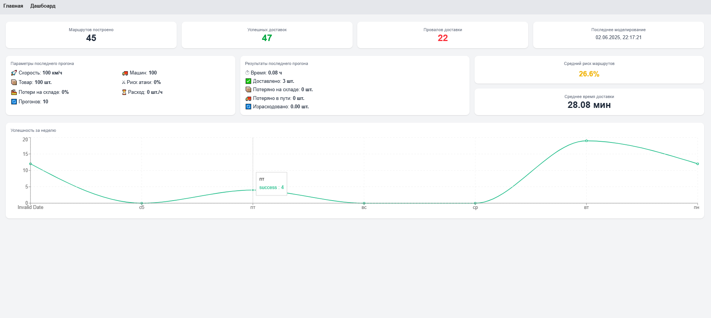

# Выпускная квалификационная работа 

**Тема:** Разработка программной модели поддержки материально-технического обеспечения

## Описание работы
В данной работе разработана **программная реализация модели** поддержки материально-технического обеспечения (МТО).  
Основой модели является **метод имитационного моделирования**, который позволяет учитывать случайные факторы и неопределённости внешней среды при моделировании процессов МТО.

## Объект и предмет исследования
- **Объект исследования:** программная модель, в основе которой используется метод имитационного моделирования для учёта случайных факторов и неопределённостей внешней среды в процессах МТО.  
- **Предмет исследования:** процессы материально-технического обеспечения.

## Цель работы
Разработка программной модели поддержки материально-технического обеспечения, которая позволит оптимизировать процессы с учётом случайных и динамически меняющихся факторов.

## Задачи исследования
Для достижения поставленной цели были сформулированы следующие задачи:  
1. Проведение обзора аналогов программных продуктов.  
2. Построение математической модели с учётом случайных факторов.  
3. Проектирование архитектуры программной модели.  
4. Разработка программной реализации модели поддержки материально-технического обеспечения.  
5. Проведение тестирования реализованной модели.

## Используемые технологии
- **React** — JavaScript-библиотека для создания высокопроизводительных и интерактивных пользовательских интерфейсов.  
- **Node.js** — серверная платформа, обеспечивающая асинхронный ввод-вывод, единый язык программирования (JavaScript) на клиенте и сервере, а также горизонтальное масштабирование при росте нагрузки.  
- **Tailwind CSS** — CSS-фреймворк с утилитарным подходом для быстрой стилизации адаптивных интерфейсов.  
- **OpenStreetMap** — открытый геоинформационный сервис, используемый для визуализации маршрутов и логистических данных без лицензионных ограничений.

## Разработанный интерфейс
Ниже представлены два ключевых экрана веб-интерфейса модели:

1. **Главная страница**  
   

2. **Страница дашборда**  
   

> _Заметка:_ файлы скриншотов лежат в каталоге `docs/` репозитория.

## Пользовательская инструкция
1. **Установка и запуск**
   
   a. Клонируйте репозиторий:  
   ```bash
   git clone https://github.com/TatyanaYarusova/Software-model-of-logistics-support.git
   cd Software-model-of-logistics-support
   ```  
   b. Установите зависимости:  
   ```bash
   npm install
   ```  
   c. Запустите приложение локально:  
   ```bash
   npx run dev
   ```  
   Клиентское приложение будет доступно по адресу <http://localhost:3000>.
   
2. **Работа с интерфейсом**

    a. Задание параметров эксперимента  
    На главной странице отображается карта (**OpenStreetMap**) с возможностью указания начальных и конечных точек, а также другие параметры эксперимента.  
  
    b. Проведение эксперимента (построение маршрута)    
    Нажатие кнопки **«Смоделировать»** запускает процесс имитационного моделирования, учитывающий текущие параметры риска и трафика. Результат эксперимента отобразится на карте.
  
    c. Просмотр статистики   
    перейдите на страницу дашборда. На данной странице отображается:  
    
    - количество построенных маршрутов;  
    - количество успешных доставок;
    - количество неуспешных доставок;    
    - результат последнего моделирования;
    - среднее время доставки;
    - графики количества проведенных успешных моделирований.  

## Тестирование

Все тесты расположены в папке `tests/`.

### Запуск тестов
```bash
npm run test
```

## Заключение
В рамках выполнения работы были достигнуты следующие результаты:

1. Проведён **обзор аналогов** программных продуктов для поддержки МТО и **сформированы требования** к программной модели.  
2. Разработана **математическая модель** на основе имитационного моделирования с учётом случайных факторов внешней среды.  
3. Спроектирована **архитектура** программного решения.   
4. Реализована **программная модель** поддержки МТО  
   (стек: React, Node.js, Tailwind CSS, OpenStreetMap).  
5. Выполнено **тестирование**  
   – 32 unit-теста и 4 интеграционных теста;  
   – среднее покрытие кода тестами — **94 %**.  
6. Проведён эксперимент и установлена зависимость **процента успешных доставок** от уровня **риска атак**.

## Дальнейшие направления исследования
- Расширение функциональности модели и интеграции с внешними сервисами.  
- Оптимизация алгоритмов моделирования.

### Демонстрация работы модели


## Ссылки
- **Репозиторий:** <https://github.com/TatyanaYarusova/Software-model-of-logistics-support.git>  
- **Демо:** <https://github.com/TatyanaYarusova/Software-model-of-logistics-support/blob/main/demo/demo.mp4>
